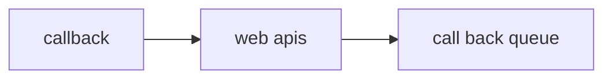

## The phenomena of event contect


## Promises in javascript 
```js 
promises:-
1. take resolve and reject

function add(a,b){
  return new Promise((resolve,reject)=>{
    setTimeout(()=>{
      resolve(a+b)
    },0)
  })
}
```